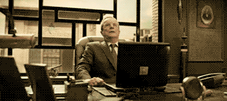

---
  .title= "Web Dev is Now Exciting (to me)",
  .description= "We don't need to use javascript/react",
  .author= "Angel (Ttecho)",
  .layout= "post.html",
  .date= @date("2024-02-11T13:55:00"),
  .draft= true,
---

### Welcome to sync'd gaze!  

You're most likely reading my first blog post that I written and debugged many times over, getting this site up and to a usable state. 



This is site was my idea of making myself more presentable to people outside of my normal circle and to test out technology that I haven't used.

I looked into javascript, react, and the normal things you would use to build a website.

Others might enjoy those technologies but they do not spark joy for me. 

Next step was to jump on the [Rust](https://www.youtube.com/watch?v=TGfQu0bQTKc) train. This included going through the various opinonated [libraries](https://www.arewewebyet.org/) to decided. I picked Leptos for the wrong reasons... 

Which I was enjoying but felt I it was difficult for just a basic website up and running... 

(ofc it is because I am a web and rust **NOOB**) 

```What have I done with my life...```

I decided to just start the site with pure basic html/css sprinkled with small libraries from [bigsky.software](https://bigsky.software/) and [friends](https://missing.style/). 

Usually I tend to lurk on discord & twitch. One day I pinged with notifications from `Kristoff` the VP of community for [ZSF](https://ziglang.org/) introducing a new project that would be up my alley, [Zine](https://github.com/kristoff-it/zine). 

'Zine' is a static site generator, that allowed me the best opportunities:

- Using zig for everything!
- Being able to make my site quickly
- Not javascript
- Keep using my HTML/CSS I created
- Not convoluted

I will be posting updates as well as things about music and technology in general. 
